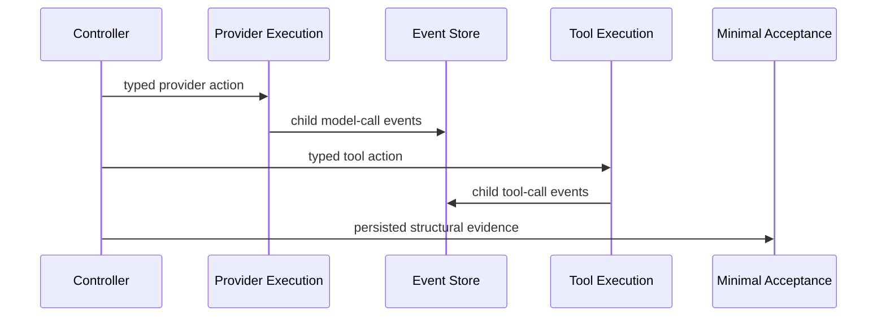

# Bounded Cognitive Controller

The controller is a Cognitive OS application service over the existing provider, Tool Plane,
event, artifact, approval, registry, telemetry, and replay boundaries. It selects exactly one
ready plan step, records the decision and step start, invokes the existing execution service,
records the terminal result, checkpoints, and verifies. Provider output proposes data only;
it cannot change state, budget, policy, approval, or completion.

