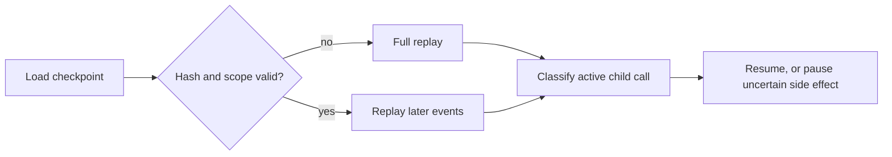

# Controller checkpoint and recovery

Checkpoints are deterministic, hashed artifacts bound to task and stream version. Full replay
is always available. A requested child with no start may be reevaluated; a started child with
no terminal event is uncertain. Uncertain provider calls and side-effecting tools are not
blindly repeated. Expected-version conflicts stop the writer and require replay.
