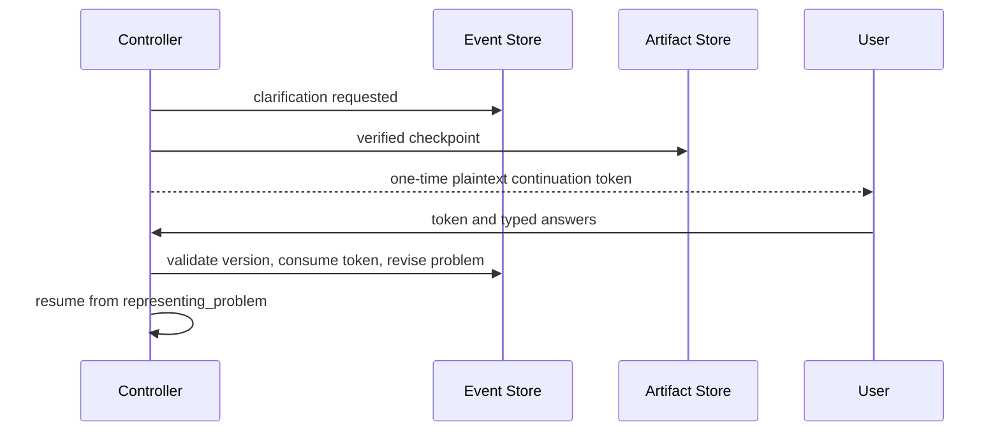

# Controller clarification

Only token hashes enter persistence. Answers must match the requested question IDs and their
JSON Schemas. Expired, altered, consumed, wrong-task, wrong-checkpoint, stale-version, and
terminal-run continuations fail before representation revision.
