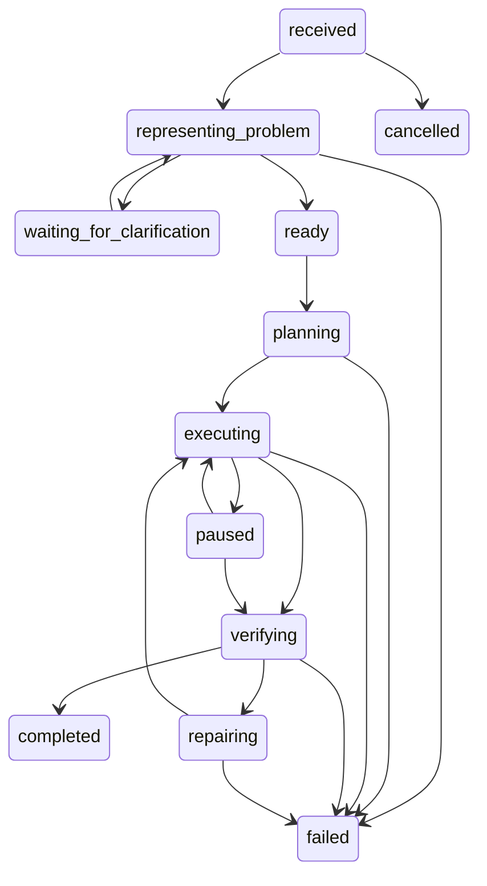

# Controller state machine

Every state and transition is defined in `controller/transitions.py`; exhaustive tests reject
all other source-target pairs. Terminal states have no outgoing edges.

Active states also have the explicit cancellation and budget-exhaustion transitions declared
by the transition table. Every transition carries a decision ID, reason, and expected version.
